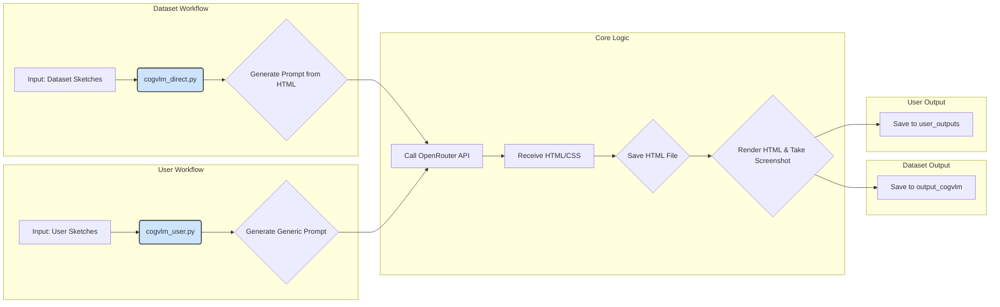

# Sketch2Code: AI-Powered HTML/CSS Generation from UI Sketches

This project leverages the CogVLM (Cognitive Vision Language Model) via the OpenRouter API to automatically convert user interface (UI) sketches into functional HTML and CSS code. It provides scripts to process both a pre-existing dataset of sketches and new, user-uploaded images.

## ✨ Features

- **AI-Powered Code Generation**: Utilizes a powerful vision-language model to interpret UI sketches and generate corresponding HTML/CSS code.
- **Two Processing Modes**:
  - **Dataset Mode (`cogvlm_direct.py`)**: Processes a collection of sketches from the `sketch2code_dataset_v1` dataset, using specific prompts derived from existing HTML metadata.
  - **User Mode (`cogvlm_user.py`)**: Converts individual sketches uploaded by a user into HTML, using a general-purpose prompt.
- **Automated Screenshot Generation**: After generating the HTML for a sketch, the project automatically takes a screenshot of the rendered webpage for visual verification.
- **Utility Scripts**: Includes helper scripts for data preparation and API testing.

## 📂 Project Structure

```
/
├── sketch2code_dataset_v1/ # Dataset containing original sketches and webpages
│   ├── sketches/
│   └── webpages/
├── user_uploads/           # Directory for user-provided sketches (input)
├── output_cogvlm/          # Directory for generated HTML/screenshots from the dataset (output)
├── user_outputs/           # Directory for generated HTML/screenshots from user uploads (output)
├── utils/                  # Helper functions for prompts, file handling, and screenshots
├── cogvlm_direct.py        # Main script for processing the sketch dataset
├── cogvlm_user.py          # Script for processing user-uploaded sketches
├── move_images_and_verify.py # Utility to organize the dataset files
├── API_test.py             # Simple script to test the OpenRouter API connection
└── venv/                   # Python virtual environment
```

## 🚀 Getting Started

### 1. Prerequisites

- Python 3.x
- An API key from [OpenRouter.ai](https://openrouter.ai/)

### 2. Installation & Setup

1.  **Clone the repository:**
    ```bash
    git clone <your-repository-url>
    cd Sketch2Code
    ```

2.  **Create and activate a virtual environment:**
    ```bash
    python -m venv venv
    source venv/bin/activate
    ```

3.  **Install the required dependencies:**
    ```bash
    pip install requests pillow tqdm
    ```

4.  **Set up your API key:**
    The scripts require your OpenRouter API key to be available as an environment variable. 
    ```bash
    export OPENROUTER_API_KEY="your-api-key-here"
    ```
    *Note: Add this line to your `~/.bashrc` or `~/.zshrc` file to make it permanent.*

### 3. Prepare the Dataset (Optional)

If you are using the `sketch2code_dataset_v1`, you may need to organize the image files. The `move_images_and_verify.py` script is provided for this purpose. It moves all image files from the `webpages` directory to the `sketches` directory and verifies which sketches have a corresponding HTML file.

```bash
python move_images_and_verify.py
```

## Workflow Diagram



## Usage

This project offers two primary modes of operation.

### 1. Processing the Sketch2Code Dataset

Use the `cogvlm_direct.py` script to process the included dataset. It reads sketches, generates HTML, and saves the output and a corresponding screenshot to the `output_cogvlm` directory.

```bash
python cogvlm_direct.py --limit 10
```

- `--input_dir`: Path to the directory containing sketch images (default: `sketch2code_dataset_v1/sketches`).
- `--html_dir`: Path to the directory containing original HTML files (default: `sketch2code_dataset_v1/webpages`).
- `--out_dir`: Path to save the generated files (default: `output_cogvlm`).
- `--limit`: The maximum number of sketches to process (default: `3`).

### 2. Converting a Custom User Sketch

To convert your own sketch, place your image file (e.g., `my_design.png`) into the `user_uploads` directory and run the `cogvlm_user.py` script.

```bash
python cogvlm_user.py
```

- The script will process all `.png` files in the `user_uploads` directory.
- The generated HTML and screenshot will be saved in the `user_outputs` directory with the same base name as the input file which will be downloadable.

## 🛠️ Utilities

- **`API_test.py`**: A simple script to verify that your API key is configured correctly and that you can connect to the OpenRouter API.
  ```bash
  python API_test.py
  ```
